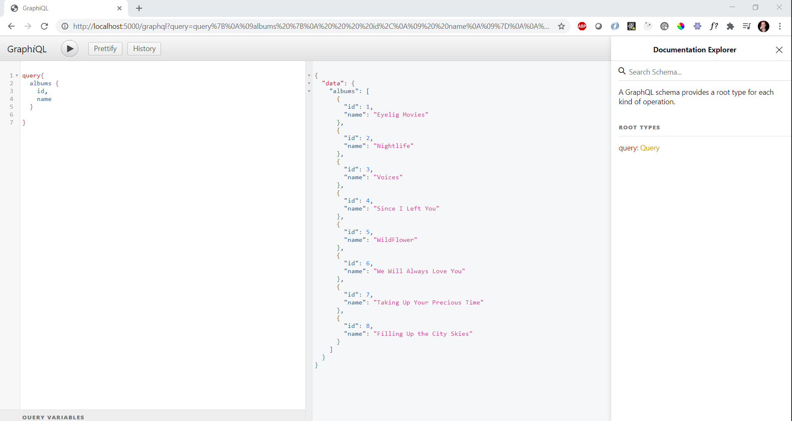
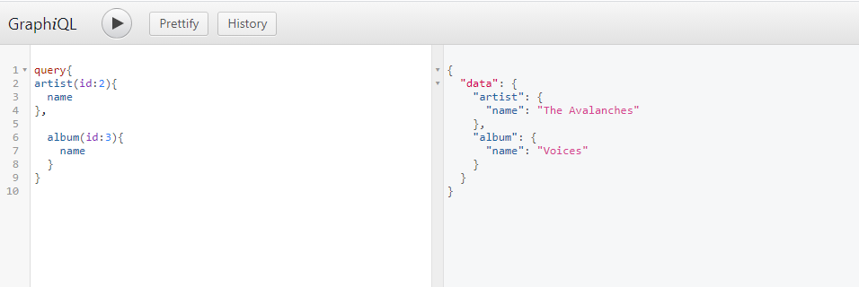
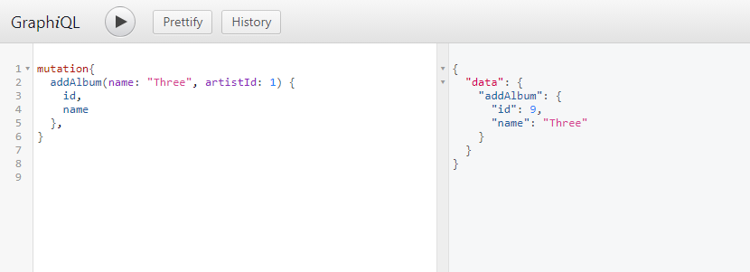
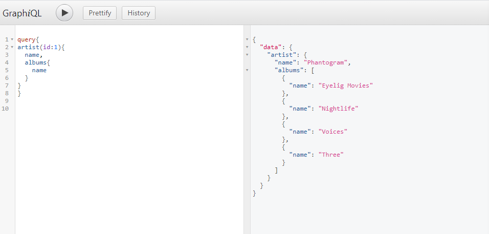

**Benefits:** Allows you to get all the information you need from a server in one call, as opposed to potentially multiple with REST.

### Project Dependencies

- npm i express express-graphql graphql

### Set-up User Test Interface

The "npm i express-graphql" has a function called "graphiql"; import this from "express-graphql" and set it to "true" within your GraphQL end point and you can access and trouble shoot your api via the browser similar to Postman.

**Example:**

```
app.use(
  "/graphql",
  expressGraphQL({
    schema: schema,
    graphiql: true,
  })
);
```



### NonNull middleware

- imported from "npm i graphql", this ensures a type will not return an empty or invalid value.

**Example:**

- As seen below, the GraphQLNonNull Object ensure the integer (GraphQLInt) and string (GraphQLString) types do not return an invalid value.

```
const albumType = new GraphQLObjectType({
  name: album,
  description: "This represents an album composed by an artist",
  fields: () => ({
    id: { type: GraphQLNonNull(GraphQLInt) },
    name: { type: GraphQLNonNull(GraphQLString) },
    artistId: { type: GraphQLNonNull(GraphQLInt) },
  }),
});
```

### Extending Tables

You reference another "GraphQLObjectType" from within a field to create a reference to another table.

As seen where I call the resolve within the "artist" object, I pass the "parent" objectType as variable name album (or name it whatever you want) so that I can create a reference to return the fields I want.

**Example:**

```
const AlbumType = new GraphQLObjectType({
  name: "Album",
  description: "This represents an album composed by an artist",
  fields: () => ({
    id: { type: GraphQLNonNull(GraphQLInt) },
    name: { type: GraphQLNonNull(GraphQLString) },
    artistId: { type: GraphQLNonNull(GraphQLInt) },
    artist: {
      type: ArtistType,
      resolve: (album) => {
        return artists.find((artist) => artist.id === album.artistId);
      },
    },
  }),
});
```

You can also create Root querys for single items, as opposed to Lists, in the Root Query (**_type: RootQueryType_**). In the example below, we establish an argument (passed as **_args_** in GraphQL) to allow us to filter down to a single album or artist.

**Example:**

```
const RootQueryType = new GraphQLObjectType({
  name: "Query",
  description: "Root Query",
  fields: () => ({
    album: {
      type: AlbumType,
      description: "Return a single album.",
      args: {
        id: { type: GraphQLInt },
      },
      resolve: (parent, args) => albums.find((album) => album.id === args.id),
    },
        artist: {
      type: ArtistType,
      description: "Return a single band.",
      args: {
        id: { type: GraphQLInt },
      },
      resolve: (parent, args) =>
        artists.find((artist) => artist.id === args.id),
    },
```



### Mutations

- Mutations are GraphQL's way of modifying data(**_*post, put and delete on a Rest API server*_**).

To begin, add and define "mutation" within the schema alongside our query schema.

```
const schema = new GraphQLSchema({
  query: RootQueryType,
  mutation: RootMuationType
});
```

Next, we create the mutation type. You will see that we pass the information we are looking to add into the argument (args) parameter; I also return the value populated by the args field so that I can see it returned in my GraphiQL test environment.

```
const RootMuationType = new GraphQLObjectType({
  name: "Mutation",
  description: "Root Mutation",
  fields: () => ({
    addAlbum: {
      type: AlbumType,
      description: "Add an Album",
      args: {
        name: { type: GraphQLNonNull(GraphQLString) },
        artistId: { type: GraphQLNonNull(GraphQLInt) },
      },
      resolve: (parent, args) => {
        const album = {
          id: albums.length + 1,
          name: args.name,
          artistId: args.artistId,
        };
        albums.push(album);
        return album;
      },
    },
```

**Note About Mutations GraphiQL Test**

- Note that below I put my name -- which is a string input -- in double quotes. This is because GraphiQL follow will not recognize single quotes, similar to JSON.



Now when we do an album search, we see that this has been added to our pseudo-database.


